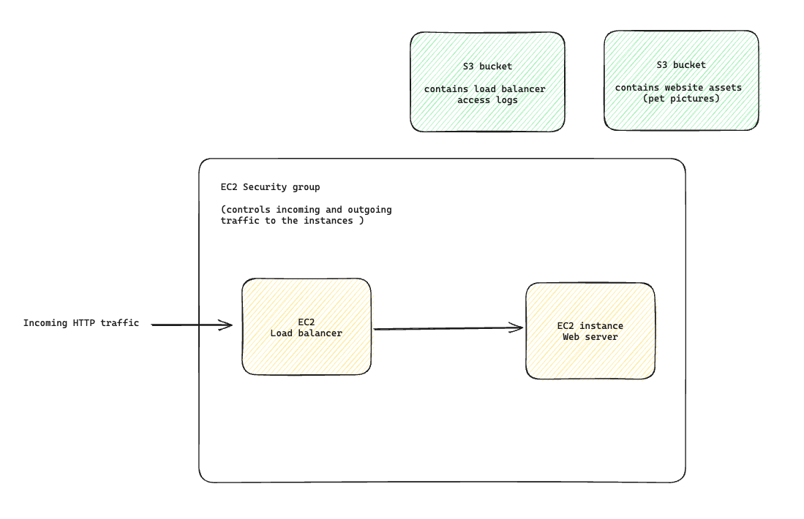

# Poochie Pals, deployed

The engineering team has now deployed a staging (pre-production) version of the
application online.

Your job will be to investigate this cloud setup to identify potential
vulnerabilities.

## The application

The above image shows incoming http traffic going through an EC2 security group to an EC2 load balancer then to an EC2 web server. Separate to the EC2 security group are 2 S3 buckets, one has load balancer logs and one has website assets (pet pictures).

## Project

Investigate security vulnerabilities in the "staging" deployed cloud application
of Poochie Pals. You might want to distribute the work and work in pairs on this
one.

Once this is done, [submit your work using this
link](https://airtable.com/appJ1wvInmFyFFYlN/shrvo9ePjlwnaiLv5?prefill_Item=ce_security_01)
(make sure to include the names of everyone in your team), and reach out to your
coach. They'll likely ask questions on your diagram, and what potential security
issues you've identified. 

### Resources

[The OWASP Zap program](https://www.zaproxy.org/)

## What to do after

Researching vulnerabilities in an already deployed setup can be ineffective
— can you see why?

We can do better, and start thinking about security before the application is
fully finished and deployed. This is often called "moving security left",
because the work on security happens from the beginning of the engineering
process, not at the end.

In the next challenge, you will apply a process called Threat Modelling on a
system not yet implemented.

[Next Challenge](03_challenge.md)

<!-- BEGIN GENERATED SECTION DO NOT EDIT -->

---

**How was this resource?**  
[😫](https://airtable.com/shrUJ3t7KLMqVRFKR?prefill_Repository=devops-course&prefill_File=security/projects/02_deployment.md&prefill_Sentiment=😫) [😕](https://airtable.com/shrUJ3t7KLMqVRFKR?prefill_Repository=devops-course&prefill_File=security/projects/02_deployment.md&prefill_Sentiment=😕) [😐](https://airtable.com/shrUJ3t7KLMqVRFKR?prefill_Repository=devops-course&prefill_File=security/projects/02_deployment.md&prefill_Sentiment=😐) [🙂](https://airtable.com/shrUJ3t7KLMqVRFKR?prefill_Repository=devops-course&prefill_File=security/projects/02_deployment.md&prefill_Sentiment=🙂) [😀](https://airtable.com/shrUJ3t7KLMqVRFKR?prefill_Repository=devops-course&prefill_File=security/projects/02_deployment.md&prefill_Sentiment=😀)  
Click an emoji to tell us.

<!-- END GENERATED SECTION DO NOT EDIT -->
